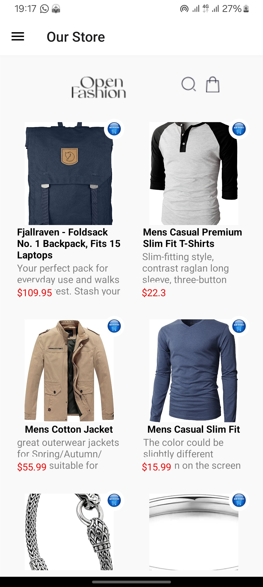
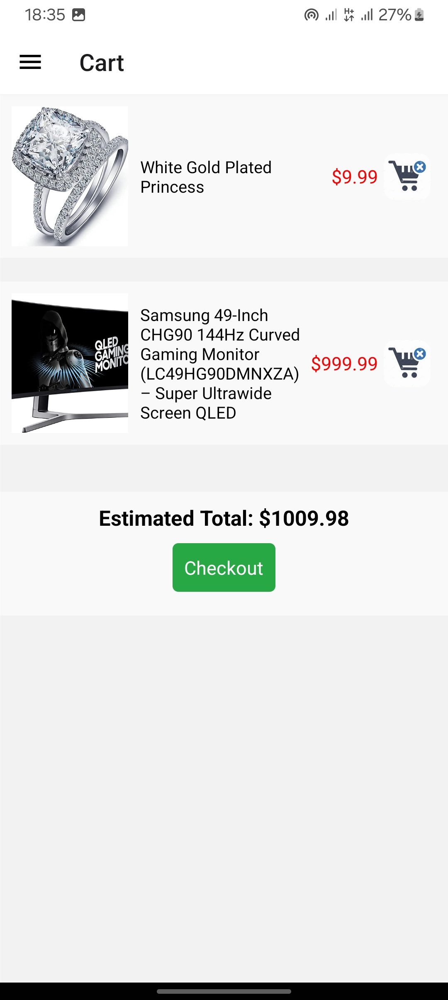

# This is a simple shopping cart application built with React Native and Expo. The app allows users to view a list of products, add products to their cart, view the items in their cart, and remove items from their cart. The cart data is stored locally on the device using the AsyncStorage.

# Features

Home Screen: Displays a list of available products.
Product Details Screen: Displays details description of items.
Cart Screen: Displays selected items in the cart, shows the estimated total, and includes checkout and navigation buttons.
Add to Cart: Button to add a product to the cart.
Remove from Cart: Button to remove a product from the cart.
Local Storage: Uses AsyncStorage to store cart data locally on the device.

AsyncStorage: Used for storing the cart data locally. This ensures that the cart data persists even if the app is closed or restarted.
Navigation:

React Navigation: Used to navigate between the HomeScreen,the CartScreen and the Product Details Screen.

# Screenshots

# rn-assignment7-11254373
